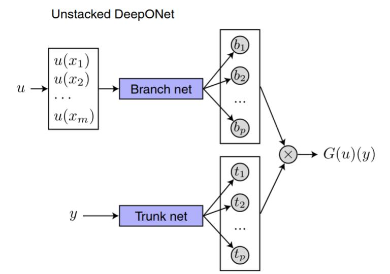

# Problem Setting
This subproject contains multiple tasks about a thermal energy storage model. We model a device used for storing energy in a cyclic fashion with every cycle containing the following steps: Charging, idle, discharging and idle. The energy storage is happening through a interaction between a solid and a liquid phase.

## Mathematical Model
The main quantities to model are the solid and fluid temperatures. The system is described by the following reaction-convection-diffusion equations:

$$\varepsilon \rho_{f} C_{f} \frac{\partial T_{f}}{\partial t}+\varepsilon \rho_{f} C_{f} u_{f}(t) \frac{\partial T_{f}}{\partial x}=\lambda_{f} \frac{\partial^{2} T_{f}}{\partial x^{2}}-h_{v}\left(T_{f}-T_{s}\right) \quad x \in[0, L], t \in[0, T]$$

$$(1-\varepsilon) \rho_{s} C_{s} \frac{\partial T_{s}}{\partial t}=\lambda_{s} \frac{\partial^{2} T_{s}}{\partial x^{2}}+h_{v}\left(T_{f}-T_{s}\right) \quad x \in[0, L], t \in[0, T]$$

Where $\rho$ is the density of the phases, $C$ is the specific heat capacity, $\lambda$ is the diffusivity, $\epsilon$ is the solid porosity, $u_{f}$ is the fluid velocity, and $h_{v}$ is the heat exchange rate coefficient.

Further, suitable initial and boundary conditions are needed:

$$T_{f}(x, t=0)=T_{s}(x, t=0)=T_{0},\quad x \in[0, L] $$

$$\left.\frac{\partial T_{s}(x, t)}{\partial x}\right|_{x=0}=\left.\frac{\partial T_{s}(x, t)}{\partial x}\right|_{x=L}=0,\quad t \in[0, T]$$

- Charging State

$$T_{f}(0, t)=T_{h o t},\left.\quad \frac{\partial T_{f}(x, t)}{\partial x}\right|_{x=L}=0, \quad t \in[0, T]$$

- Discharging State:

$$\left.\frac{\partial T_{f}(x, t)}{\partial x}\right|_{x=0}=0, \quad T_{f}(L, t)=T_{\text {cold }}, \quad t \in[0, T]$$

- Idle Phase:

$$\left.\frac{\partial T_{f}(x, t)}{\partial x}\right|_{x=0}=0,\left.\quad \frac{\partial T_{f}(x, t)}{\partial x}\right|_{x=L}=0, \quad t \in[0, T]$$

# Task 1

## Task Description
The equations are normalized and only the system during charging is examined:

$$\frac{\partial \bar{T}_{f}}{\partial t}+U_{f} \frac{\partial \bar{T}_{f}}{\partial x}=\alpha_{f} \frac{\partial^{2} \bar{T}_{f}}{\partial x^{2}}-h_{f}\left(\bar{T}_{f}-\bar{T}_{s}\right) \quad x \in[0,1], t \in[0,1]$$

$$\frac{\partial \bar{T}_{s}}{\partial t}=\alpha_{s} \frac{\partial^{2} \bar{T}_{s}}{\partial x^{2}}+h_{s}\left(\bar{T}_{f}-\bar{T}_{s}\right) \quad x \in[0,1], t \in[0,1]$$

with

$$\bar{T}_{f}(x, t=0) =\bar{T}_{s}(x, t=0)=T_{0}, \quad x \in[0,1]$$

$$\left.\frac{\partial \bar{T}_{s}}{\partial x}\right|_{x=0} =\left.\frac{\partial \bar{T}_{s}}{\partial x}\right|_{x=1}=\left.\frac{\partial \bar{T}_{f}}{\partial x}\right|_{x=1}=0, \quad t \in[0,1]$$

$$\bar{T}_{f}(x=0, t) =\frac{T_{h o t}-T_{0}}{1+\exp (-200(t-0.25))}+T_{0}, \quad t \in[0,1]$$

and

$$\alpha_{f}=0.05 \quad h_{f}=5 \quad T_{h o t}=4 \quad U_{f}=1$$

$$\alpha_{s}=0.08 \quad h_{s}=6 \quad T_{0}=1$$

The task is to approximate the solution of the system of PDEs with a physics informed neural network.

## Solution Approach
We model both the fluid and the solid temperature as one fully connected network with tanh activation functions.
The network has two inputs time/space and returns the fluid/solid temperatures.
This model implies that the two temperatures can be both represented as a linear superposition of the same feature.
In comparison, one could take two independent networks for both temperatures. The demerit would be higher training costs and the loss of coherence between the two outputs.
A future improvement could be a model of three parts: A feature extraction network and two smaller independent networks. The two independent networks would take the outputs from the feature extraction network as inputs and produce either fluid or solid temperature.

The loss to train the model is made up from six parts:

$$L_{int}(\phi) = L_{tb}(\phi) + L_{sb,d,x=0,fluid}(\phi) + L_{sb,n,x=1,fluid}(\phi) + L_{sb,n,x=0,solid}(\phi) + L_{sb,n,x=1,solid}(\phi) + L_{int}(\phi) $$

- Interior loss from the PDE residual
- Temporal boundary loss from the fixed initial conditions
- Spatial dirichlet boundary loss at $x=0$ for $T_f$
- Spatial neumann boundary losses at $x=1$ for $T_f$
- Spatial neumann boundary losses at $x=0$ for $T_s$
- Spatial neumann boundary losses at $x=1$ for $T_s$

Either the LBFGS or adam optimizer can be used to train the model.

 
 

# Task 2
## Task Description
In the second task, we want to solve an inverse problem with PINNs.
The first differential equations stays the same:

$$\frac{\partial \bar{T}_{f}}{\partial t}(x, t)+U_{f}(t) \frac{\partial \bar{T}_{f}}{\partial x}(x, t)=\alpha_{f} \frac{\partial^{2} \bar{T}_{f}}{\partial x^{2}}-h_{f}\left(\bar{T}_{f}(x, t)-\bar{T}_{s}(x, t)\right) \quad x \in[0,1], t \in[0,8]$$

The fluid temperature is the unknown for which measurement data is provided.
In addition, the time horizon is not anymore $1\,\text{sec}$, but $8\,\text{sec}$.
Therefore, the fluid velocity is not constant anymore, but piecewise constant:

$$U_{f} = \begin{cases}1, \quad t \in \left\{\left[0,1\right],\left[4,5\right]\right\} \\  -1, \quad t \in \left\{\left[2,3\right],\left[6,7\right]\right\}\\ 0, \quad else\\\end{cases}$$

This correspond to two cycle of charging, idle, discharging, idle.
Therefore, the right boundary conditions for every cycle have to be taken into account:

- Charging State:

$$
\bar{T}_{f}(0, t)=T_{h o t},\left.\quad \frac{\partial \bar{T}_{f}(x, t)}{\partial x}\right|_{x=1}=0, \quad t \in[0,8]
$$

- Discharging State:

$$
\left.\frac{\partial \bar{T}_{f}(x, t)}{\partial x}\right|_{x=0}=0, \quad \bar{T}_{f}(1, t)=T_{\text {cold }}, \quad t \in[0,8]
$$

- Idle Phase:

$$
\left.\frac{\partial \bar{T}_{f}(x, t)}{\partial x}\right|_{x=0}=0,\left.\quad \frac{\partial \bar{T}_{f}(x, t)}{\partial x}\right|_{x=1}=0, \quad t \in[0,8]
$$

The initial condition is:

$$\bar{T}_{f}(x, t=0)=T_{0}, x \in[0,1]$$

And the physical constants:

$$\alpha_{f}=0.005 \quad h_{f}=5 \quad T_{h o t}=4 \quad T_{\text {cold }}=T_{0}=1$$

## Solution Approach
The identical model as in task 1 is used due to the same reasoning.
In addition, the loss is extended by the measurement data loss $L_u(\theta)$.

$$\theta^\ast, \phi^\ast = argmin_{\theta, \phi} \Big(L_{int}(\theta, \phi) + \lambda_u L_u(\theta)\Big)$$

where $L_{int}(\theta, \phi)$ is the loss term from before
without the losses coming from the second differential equation and the boundary conditions for the solid temperature. 
$\lambda_u$ is parameter to balance the two losses.

It is to notice that the amount of samples has a higher impact compared to task 1, because now we need a balance with the given measurement data.

The first approach to sample the boundaries was to use a mask and enable/disable auto grad for only certain parts of the tensor. this sadly did not work. Therefore, the three different parts have to be sampled independently.

 
 

# Task 3
## Task Description
The goal o the final task is to predict future data from a given time line with operator learning.
Discrete samples of the fluid/solid temperature are given for the time $[0,T]$ with $T=520000\,\text{s}$. 
In particular, the fluid/solid temperature should be predicted in the range $[T,T_{end}]$ with $T_{end}=602168\,\text{s}$.
$210$ equally spaced samples are given. The predictions should be made at $34$ sample with the same spacing as the training data.

## Solution Approach
As operator learning should be used to solve the problem, we have to rewrite the given problem setting:

Find the operator $\mathbb{G}: X \rightarrow Y$, which fulfills the equation:
(Explicit function spaces omitted)

$$\mathbb{G}\left(\vec{v}\right) = \vec{u}$$

Where $\vec{v}$/$\vec{u}$ are the fluid/solid temperature on a domain $[T_1,T_2]$/$[T_3,T_4]$.

### Sampling Training Data
The training data is sampled from the a given long measurement through sampling intervals of certain length and the temperature afterwards. Therefore it is a tradeoff between the number of training samples and the information contained in one sample. It turned out that longer intervals are preferable.

### Architecture
The popular DeepOnet architecture is used. 

Where the branch net input are the fluid/solid temperature on one of the intervals and the trunk net input is the time of next sample.